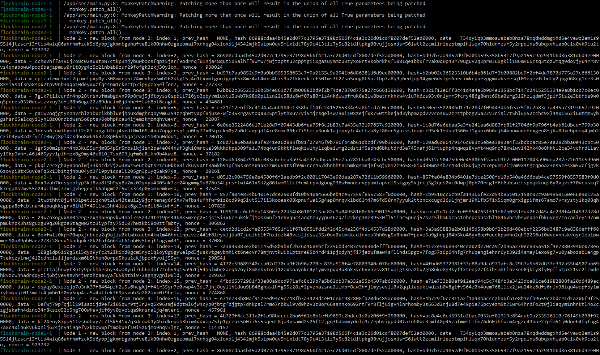
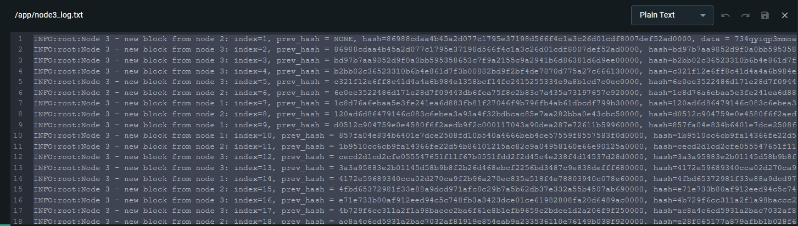

# flockbrain
Peter the Great St. Petersburg Polytechnic University: Network Programming task 2023

## Описание
Блокчейн, написанный на языке Python с использованием фреймворка Bottle.

- `Block` - класс для генерации блоков цепочки блокчейна, состоящих из следующих полей:
    - `index` - номер блока по возрастанию, начиная с 0 у `None`
    - `hash` - хеш текущего блока
    - `prev_hash` - хеш предыдущего блока
    - `data` - данные в виде строки из 256 символов
    - `nonce` - дополнение, для удовлетворения условия хэширования
- `Node` - класс узла, который хранит в себе информацию о цепочке блокчейна на данном сервере и содержит функции для обработки нового блока и генерации следующего. 

## Тестирование

[](https://github.com/tengen-toppa-gurren-lagann/flockbrain/actions/workflows/blockchain.yml)

Написаны unit-тесты.

## Запуск проекта
Для запуска проекта требуется произвести следующие действия:

1) Клонировать проект

`git clone https://github.com/tengen-toppa-gurren-lagann/flockbrain.git`

2) Перейти в директорию проекта

```cd flockbrain```

3) Создать образ 

`docker build -t flockbrain:latest .`

4) Запустить Docker Compose

`docker-compose up`

## Демонстрация работы

Демонстрация работы проекта с использованием `docker-compose`


Был написан вывод логов для каждого отдельного блока, для более удобного наблюдения и анализа.  
Содержимое логов для каждого из блоков идентично за исключением идентификатора блока, что свидетельствует о корректной работе.


Анализируя логи видно, что:
1) Изначально был сгенерирован блок с `prev_hash = None`, который был разослан всем трем узлам
2) Блок с `index = 1` был сгенерирован на `NODE_2`
3) Блок с `index = 2` был сгенерирован на `NODE_3`
4) Блок с `index = 7` был сгенерирован на `NODE_1`
5) На всех узлах хранятся одинаковые блоки
6) На всех узлах валидная цепочка блоков, так как:
   - `prev_hash` блока совпадает со значением `hash` предыдущего блока (блока с индексом на 1 меньше)
   - `prev_hash` и `hash` заканчиваются на `0000`
